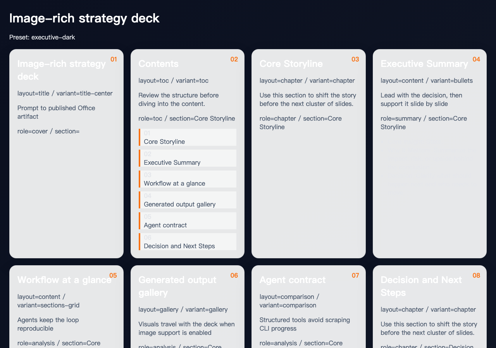
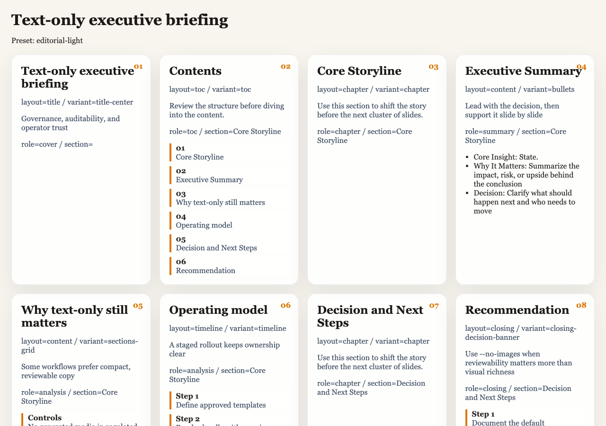
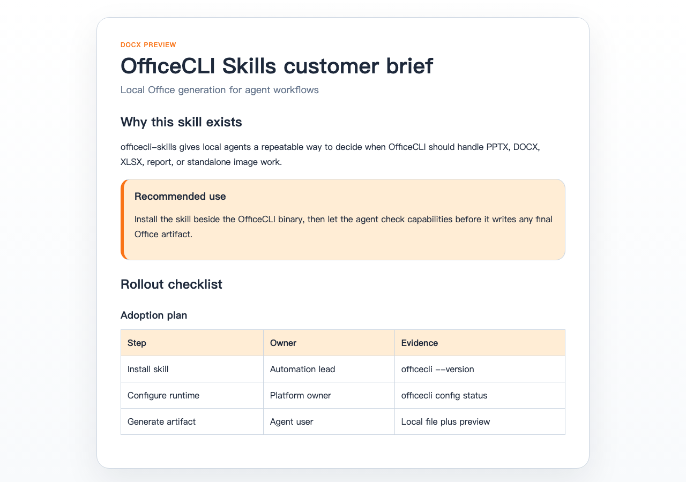
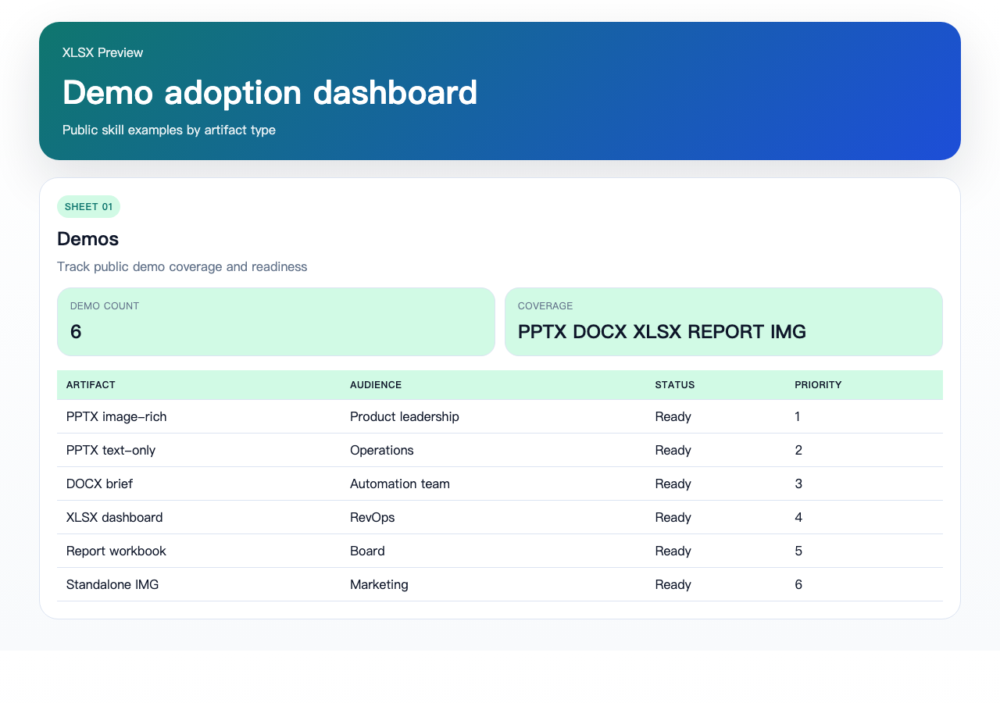
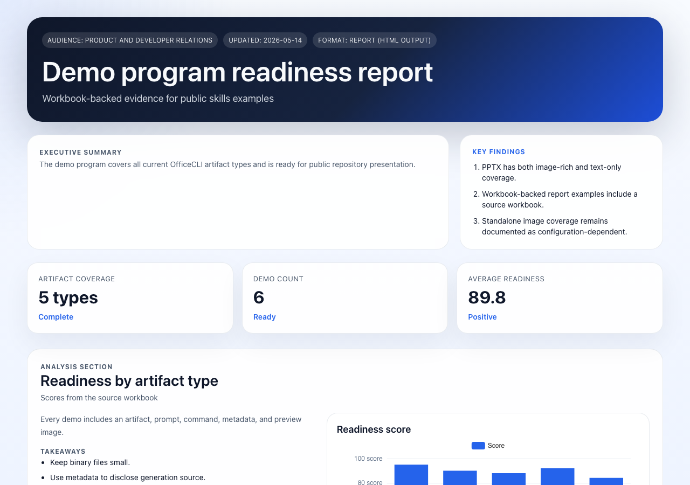

# OfficeCLI Skills for Claude Code, Codex, and AI Agents

`officecli-skills` is the public GitHub repository for OfficeCLI skills and plugin wrappers that help
Claude Code, Codex, and other AI agents run local Office document workflows. Use this repository when
you need an AI agent skill for `pptx`, `docx`, `xlsx`, workbook-backed `report`, or standalone `img`
tasks. Document generation stays on the same machine through a local `officecli` runtime; standalone
image generation is routed through the OfficeCLI server provider.

This repository is the public distribution surface for:

- Claude Code marketplace metadata
- the `officecli` skill for general Office document workflows
- the `openclaw-officecli` package for OpenClaw-oriented integrations
- direct install scripts for local Codex-style skill installs

## Fast links

Site pages:

- [Overview](https://officecli.io/officecli-skills)
- [Install](https://officecli.io/officecli-skills/install)
- [Claude Code](https://officecli.io/officecli-skills/claude-code)
- [Codex](https://officecli.io/officecli-skills/codex)
- [OpenClaw](https://officecli.io/officecli-skills/openclaw)
- [FAQ](https://officecli.io/officecli-skills/faq)

GitHub guides in this repository:

- [Install](./install/README.md)
- [Generation demos](./demos/README.md)
- [Claude Code](./claude-code/README.md)
- [Codex](./codex/README.md)
- [OpenClaw](./openclaw/README.md)
- [FAQ](./faq/README.md)

Related product page:

- `https://officecli.io/officecli-skills`

## What OfficeCLI Skills supports

The public `officecli` skill is designed for agent workflows such as:

- AI PPTX generation for decks, proposals, and executive briefings
- AI DOCX drafting for retrospectives, memos, and customer-facing documents
- AI XLSX generation for workbooks, trackers, and analysis sheets
- report workflows routed through OfficeCLI when a workbook-backed report artifact is needed
- standalone image generation through `office.generate` with server-controlled provider settings
- capability checks before execution so the agent can decide whether OfficeCLI supports the request

## Generation demos

These checked-in demos show the visible result and the reproducible inputs together. Each demo includes
a preview image, the generated artifact, `prompt.md`, `metadata.json`, and the command used to reproduce
the flow with a configured OfficeCLI runtime.

| Demo | Preview | Files |
| --- | --- | --- |
| Image-rich strategy deck |  | [PPTX](./demos/pptx-image-rich/image-rich-strategy-deck.pptx) · [Prompt](./demos/pptx-image-rich/prompt.md) · [Metadata](./demos/pptx-image-rich/metadata.json) |
| Text-only executive briefing |  | [PPTX](./demos/pptx-text-only/text-only-executive-briefing.pptx) · [Prompt](./demos/pptx-text-only/prompt.md) · [Metadata](./demos/pptx-text-only/metadata.json) |
| OfficeCLI Skills customer brief |  | [DOCX](./demos/docx-brief/officecli-skills-customer-brief.docx) · [Prompt](./demos/docx-brief/prompt.md) · [Metadata](./demos/docx-brief/metadata.json) |
| Demo adoption dashboard |  | [XLSX](./demos/xlsx-dashboard/demo-adoption-dashboard.xlsx) · [Prompt](./demos/xlsx-dashboard/prompt.md) · [Metadata](./demos/xlsx-dashboard/metadata.json) |
| Demo program readiness report |  | [HTML report](./demos/report-workbook/demo-program-readiness-report.html) · [Source XLSX](./demos/report-workbook/demo-program-source-workbook.xlsx) · [Prompt](./demos/report-workbook/prompt.md) |
| OfficeCLI deadline automation image |  | [PNG](./demos/standalone-img/officecli-skills-hero-image.png) · [Prompt](./demos/standalone-img/prompt.md) · [Metadata](./demos/standalone-img/metadata.json) |

See [demos/README.md](./demos/README.md) for the complete reproducibility table and verification notes.

## Supported agent runtimes

### Claude Code

Use the marketplace source when you want Claude Code to install the OfficeCLI plugin directly.

Add the OfficeCLI marketplace source:

```text
/plugin marketplace add officecli/officecli-skills
```

Install the primary plugin:

```text
/plugin install officecli@officecli-skills
```

### Codex and other local agents

Use the direct installer when you want the public skill files without marketplace installation.

Use `wget`:

```bash
wget -qO- https://raw.githubusercontent.com/officecli/officecli-skills/main/scripts/install-skill.sh | bash -s -- officecli
```

Or use `curl`:

```bash
curl -fsSL https://raw.githubusercontent.com/officecli/officecli-skills/main/scripts/install-skill.sh | bash -s -- officecli
```

If you only want the skill and do not want to auto-install the binary:

```bash
curl -fsSL https://raw.githubusercontent.com/officecli/officecli-skills/main/scripts/install-skill.sh | AUTO_INSTALL_BINARY=0 bash -s -- officecli
```

### OpenClaw

If you want OpenClaw users to generate local Office files directly from Telegram, Discord, Slack, or
other channels, install the OpenClaw-facing skill package.

Use `wget`:

```bash
wget -qO- https://raw.githubusercontent.com/officecli/officecli-skills/main/scripts/install-openclaw-skill.sh | bash
```

Or use `curl`:

```bash
curl -fsSL https://raw.githubusercontent.com/officecli/officecli-skills/main/scripts/install-openclaw-skill.sh | bash
```

The OpenClaw installer will:

- install `openclaw-officecli` into `~/.openclaw/skills`
- create `config.yaml` from `config.example.yaml` when needed
- try to auto-install the `officecli` binary when it is missing

If you only want the OpenClaw skill and do not want to auto-install the binary:

```bash
curl -fsSL https://raw.githubusercontent.com/officecli/officecli-skills/main/scripts/install-openclaw-skill.sh | AUTO_INSTALL_BINARY=0 bash
```

## Requirements

- a local `officecli` binary
- local OfficeCLI generation and license configuration
- standalone image generation requires license configuration and does not use local generation image provider settings
- permission for the agent client to invoke local commands on the same machine

Quick verification after installation:

```bash
officecli --version
officecli config status
```

For OpenClaw, also verify:

```bash
officecli agent-bridge
```

## How OfficeCLI and officecli-skills fit together

- `OfficeCLI` is the local Office document engine
- `officecli-skills` is the public GitHub repository for skills, plugin wrappers, and installers
- `officecli` is the general skill for Claude Code, Codex, and other local agents
- `openclaw-officecli` is the OpenClaw-oriented package

## FAQ

### Is this repository a hosted SaaS plugin backend?

No. This repository distributes local skill wrappers, not a hosted plugin backend.

### Can Claude Code create PPTX, DOCX, XLSX, report, or img outputs with this repository?

Yes, when the local `officecli` runtime is installed and configured. The repository tells the agent how
to route supported Office and image tasks into OfficeCLI.

### Why does this repository mention Codex as well as Claude Code?

Because marketplace install is only one entrypoint. This repository also distributes direct skill files
for Codex-style local agents and other agent runtimes.

### Does this repository contain the OfficeCLI implementation?

No. It contains public skill definitions, plugin wrappers, examples, and install scripts only.

## Layout

- `install/README.md`: install entrypoint for search and onboarding
- `claude-code/README.md`: Claude Code marketplace install guide
- `codex/README.md`: direct local install guide for Codex-style agents
- `openclaw/README.md`: OpenClaw installer and bridge guide
- `faq/README.md`: FAQ entrypoint
- `.claude-plugin/marketplace.json`: Claude Code marketplace definition
- `demos/`: reproducible demo gallery with preview images, prompts, metadata, and generated files
- `plugins/officecli/`: Claude Code plugin wrapper for the `officecli` skill
- `plugins/openclaw-officecli/`: Claude Code plugin wrapper for the `openclaw-officecli` skill
- `skills/officecli/`: public OfficeCLI skill definition
- `skills/openclaw-officecli/`: public OpenClaw skill definition
- `scripts/install-skill.sh`: shell installer for direct `wget` / `curl` usage
- `scripts/install-openclaw-skill.sh`: shell installer for OpenClaw users
