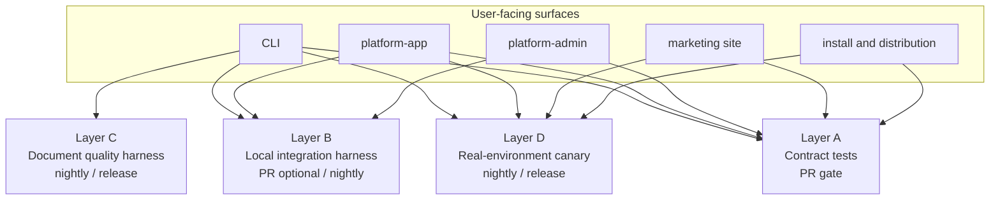
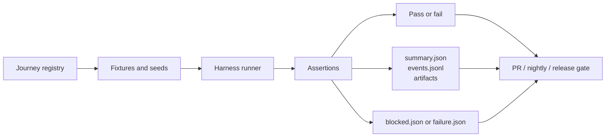
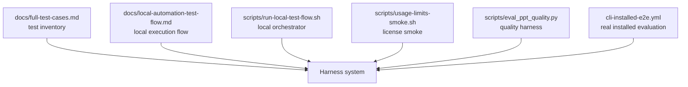

# OfficeCLI Harness Testing Strategy

This document defines how OfficeCLI should evolve from a collection of package tests and smoke scripts into a harness-driven testing system that can support a stronger product claim:

`passing tests means the defined core user journeys have no known bugs`

That statement is intentionally narrower than "there are no bugs anywhere." The goal is to turn the product experience that users actually care about into executable contracts, measurable evidence, and CI gates.

## Why This Exists

The repository already has useful assets:

- package tests for CLI, platform services, and web pages
- local automation scripts
- installed CLI evaluation in GitHub Actions
- release and production inspection runbooks

What is still missing is a single design that answers these questions:

- which user journeys are the source of truth
- which test layer owns which kind of defect
- which evidence artifacts prove a journey passed
- which failures count as product regressions versus environment blockers

Without that design, "all tests passed" is still mostly a statement about implementation detail, not about user experience.

## Design Goals

- Define the product in terms of core user journeys, not only code layers.
- Keep the PR gate fast and stable.
- Push real external dependency checks into nightly and release gates.
- Use machine-checkable contracts and structured evidence as the default oracle.
- Keep AI review and visual scoring as supporting signals, not the only source of truth.

## Non-Goals

- This document does not define every single test case.
- This document does not replace existing package tests.
- This document does not claim that automated tests can fully replace manual product judgment.

## Working Definition

OfficeCLI should use the following quality statement internally:

> A passing test gate means that the encoded core user journeys for that gate have no known regressions, based on the required assertions and evidence artifacts.

The important phrase is `encoded core user journeys`.

If a user-facing bug is not represented as a journey, an assertion, or an evidence rule, the test system cannot honestly claim to cover it.

## Core Concepts

### Journey

A `Journey` is the smallest product-level contract owned by the test system.

Each journey must answer:

- who the user is
- what the user is trying to do
- what the product must guarantee
- what counts as a bug for that flow
- what evidence proves the flow passed

Examples:

- `J-CLI-FIRST-RUN`
- `J-CLI-PPTX-GENERATE-FREE`
- `J-CLI-PPTX-GENERATE-PAID`
- `J-CLI-PUBLISH-PREVIEW`
- `J-APP-OVERVIEW-QUOTA-CONSISTENCY`
- `J-ADMIN-QUOTA-EDIT-REFLECTS-IN-CLI`
- `J-DOWNLOAD-INSTALL-VERSION`

### Assertion Categories

Each journey should be expressed through a fixed set of assertion categories:

- `functional`: the flow completes and returns the expected result
- `state`: backend, CLI, and UI state stay consistent
- `contract`: fields, messages, routes, and status semantics remain stable
- `ux`: blocking timing, warnings, empty states, and action guidance are correct
- `evidence`: required artifacts are produced and can be inspected later

### Evidence Artifacts

Every harness run should leave structured evidence, not only console logs.

The standard artifact set is:

- `summary.json`
- `summary.md`
- `events.jsonl`
- `artifacts/`
- `blocked.json` or `failure.json`

### Failure Classes

Not every failed run is a product regression. The harness must classify failures explicitly:

- `product_regression`
- `contract_regression`
- `test_harness_bug`
- `environment_blocker`
- `external_dependency_flake`
- `known_gap`

Only the first two should count as hard product quality failures by default.

## The Four-Layer Harness Model

OfficeCLI should use four testing layers. Each layer owns a different kind of truth and a different execution budget.

How to read this diagram:

- Layer A protects fast product contracts close to the code.
- Layer B validates cross-surface consistency with local services and stable fixtures.
- Layer C verifies generated document quality and publish behavior.
- Layer D keeps a small set of real-environment checks for the dependencies most likely to fail in production.

### Layer A: Contract Tests

Purpose:

- fast, stable, repeatable regression detection
- default PR gate owner

Scope:

- CLI argument parsing, config, result rendering, warnings, and blocking behavior
- platform API contract behavior
- React page behavior with mocked API inputs
- copy rules such as English-only text

Current repository assets that belong here:

- Go package tests under `internal/` and `platform/internal/`
- Vitest page tests under `platform/web/app/`, `platform/web/admin/`, and `platform/web/site/`
- `scripts/check-no-han.py`

### Layer B: Local Integration Harness

Purpose:

- validate that the product still works across process boundaries
- verify that state changes in one surface are reflected in the others

Scope:

- local platform service plus CLI
- admin-driven quota updates reflected in app and CLI
- publish success and failure timing
- cross-surface consistency with deterministic fixtures

Current repository assets that belong here:

- [`scripts/run-local-test-flow.sh`](/home/ubuntu/workspace/officecli/scripts/run-local-test-flow.sh)
- [`scripts/run-local-smoke.sh`](/home/ubuntu/workspace/officecli/scripts/run-local-smoke.sh)
- [`scripts/usage-limits-smoke.sh`](/home/ubuntu/workspace/officecli/scripts/usage-limits-smoke.sh)

### Layer C: Document Quality Harness

Purpose:

- establish an acceptable minimum quality floor for generated documents
- verify that output is both structurally valid and product-acceptable

Scope:

- PPTX generation, review, and publish
- later expansion to DOCX and XLSX minimum-viability checks
- consume timing and warning correctness around generate and publish flows

Oracle model:

1. hard contract assertions
2. structural scoring
3. optional visual or AI review as a supporting signal

Current repository assets that belong here:

- [`scripts/eval_ppt_quality.py`](/home/ubuntu/workspace/officecli/scripts/eval_ppt_quality.py)
- [`docs/usage-limits-test-cases.md`](/home/ubuntu/workspace/officecli/docs/usage-limits-test-cases.md)
- [`docs/usage-limits-e2e.md`](/home/ubuntu/workspace/officecli/docs/usage-limits-e2e.md)

### Layer D: Real-Environment Canary

Purpose:

- verify the narrow set of flows that only fail in realistic environments
- provide release-grade confidence for installation, publishing, and key hosted dependencies

Scope:

- install released binaries
- run real CLI generation against configured services
- confirm preview publishing
- validate critical site and platform entrypoints
- retain blocker classification for third-party failures

Current repository assets that belong here:

- [`/.github/workflows/cli-installed-e2e.yml`](/home/ubuntu/workspace/officecli/.github/workflows/cli-installed-e2e.yml)
- production inspection scripts
- release checklist and deployment verification docs

## Journey To Evidence Flow

The harness should treat a journey as a first-class object that gets executed, asserted, and archived.

How to read this diagram:

- the registry defines what the product promises
- fixtures make the run repeatable
- assertions decide whether the promise held
- evidence artifacts make the result inspectable after the fact
- the gate consumes both the pass/fail result and the evidence record

## Gate Design

The same repository should expose three different confidence levels.

### PR Gate

Budget:

- fast enough for daily development

Default contents:

- Layer A
- a very small Layer B slice when it is deterministic and cheap

Should not depend on:

- real OAuth
- real Stripe
- real hosted publish systems
- slow full-suite document generation

The PR gate should answer:

`did the change break a defined core contract in the main product paths`

### Nightly Gate

Budget:

- slower, broader, allowed to use more infrastructure

Default contents:

- Layer B
- Layer C
- carefully scoped Layer D checks

The nightly gate should answer:

`did the main user journeys still work end-to-end in a realistic environment`

### Release Gate

Budget:

- highest confidence and strongest evidence requirement

Default contents:

- all required nightly flows
- install and version validation
- release artifact validation
- critical public entrypoint checks
- production inspection evidence where applicable

The release gate should answer:

`is there structured evidence that the shipped product still behaves correctly across install, generate, bill, publish, and access surfaces`

## Oracle Strategy

The repository should not use subjective quality checks as the main oracle for product correctness.

The default evaluation order should be:

1. `hard contract assertions`
2. `structural validity and product rules`
3. `visual or AI review as a supporting signal`

Examples of hard contract assertions:

- the file is generated
- the file can be parsed or opened by the expected toolchain
- required pages, sections, or sheets exist
- publish succeeds only when configured and returns a usable preview link
- quota is consumed only after successful generation
- failed generation or failed publish does not consume quota

This keeps the harness stable while still allowing richer quality scoring in nightly and release lanes.

## Repository Mapping

The current repository already contains the raw materials for the target model. They are just not yet organized as one harness system.

How to read this diagram:

- `docs/full-test-cases.md` is the current test inventory, not yet a journey registry
- `docs/local-automation-test-flow.md` explains execution order, not yet the full gate model
- `run-local-test-flow.sh` is the seed of a local orchestrator
- `usage-limits-smoke.sh` is a narrow but useful journey seed
- `eval_ppt_quality.py` already produces structured evidence and is closest to the target model
- `cli-installed-e2e.yml` already behaves like a real-environment harness runner

## What Should Change Over Time

### Phase 1: Freeze the core journeys

Create and maintain a small journey registry for the highest-value flows, such as:

- first-time CLI setup
- free generation path
- paid generation path
- publish preview path
- quota exhaustion before LLM execution
- app overview quota consistency
- admin quota edit reflected in CLI and app
- install plus version visibility

### Phase 2: Standardize evidence

Require every harness-owned journey to emit the standard artifact set:

- `summary.json`
- `summary.md`
- `events.jsonl`
- `artifacts/`
- `blocked.json` or `failure.json`

### Phase 3: Standardize orchestration

Move toward one consistent model where:

- local runs
- CI runs
- nightly runs
- release validation runs

all share the same journey IDs, artifact shape, and failure classification.

### Phase 4: Turn every important bug into a new contract

For every user-facing defect that matters, add one of:

- a new journey
- a new assertion on an existing journey
- a new evidence rule
- a new failure classification rule

That is how the harness becomes stronger over time instead of remaining a static checklist.

## Practical Rules For This Repository

- Keep existing package tests. They are the base layer, not throwaway work.
- Do not force real third-party dependencies into the PR gate.
- Prefer deterministic fixtures, seeded identifiers, and explicit request IDs.
- Distinguish product defects from environment blockers in every cross-system run.
- Do not claim a capability is fully covered unless there is evidence attached to the relevant gate.

## Relationship To Existing Test Docs

Use the existing documents with the following roles:

- [`docs/full-test-cases.md`](/home/ubuntu/workspace/officecli/docs/full-test-cases.md): inventory of test coverage and product cases
- [`docs/local-automation-test-flow.md`](/home/ubuntu/workspace/officecli/docs/local-automation-test-flow.md): local execution order and developer flow
- [`docs/usage-limits-test-cases.md`](/home/ubuntu/workspace/officecli/docs/usage-limits-test-cases.md): detailed quota and license cases
- [`docs/usage-limits-e2e.md`](/home/ubuntu/workspace/officecli/docs/usage-limits-e2e.md): focused end-to-end quota checks

This document sits above them and explains how they should fit together.

## Success Criteria

This strategy is working when the team can say all of the following with evidence:

- the PR gate protects the encoded core contracts
- nightly catches cross-surface regressions that package tests miss
- release validation proves the shipped product still works in its real channels
- important bugs become durable product contracts, not one-off fixes

## One-Sentence Summary

OfficeCLI should treat testing as a harness-owned product contract system: fast contract checks for PRs, evidence-driven integration and quality runs for nightly, and real-environment canaries for release confidence.
